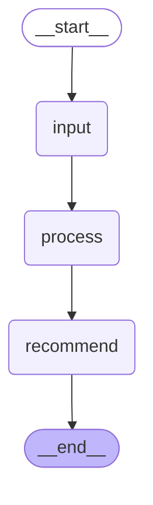

# Sales Recommendation LangGraph

A modular, node-based pipeline for processing sales data and generating actionable recommendations using [LangGraph](https://github.com/langchain-ai/langgraph).

---

## 🗂️ Project Structure

```
agent-task/
│
├── main.py                # Entry point: builds and runs the graph
├── base.py                # Base classes/interfaces for nodes
├── requirements.txt       # Python dependencies
├── Studio.mmd             # Mermaid flowchart (see below)
├── nodes/                 # All node implementations
│   ├── __init__.py
│   ├── input_node.py      # Fetches sales data
│   ├── process_node.py    # Processes/cleans data
│   └── recommend_node.py  # Generates recommendations
├── utils/                 # Utility functions/helpers
├── constants/             # Configuration/constants
├── logs/                  # Log files
└── tests/                 # Unit and integration tests
```

---

## 🧩 Node Design

Nodes communicate via well-defined interfaces, making the pipeline easy to extend or modify.

- **InputNode**: Fetches and validates sales data from source(s).
- **ProcessNode**: Cleans, transforms, and aggregates the data.
- **RecommendNode**: Analyzes processed data and outputs recommendations.

---

## 🗺️ Pipeline Flow

Below is the flow of data through the system, as described in `Studio.mmd`:



---

## 🚀 Getting Started

1. **Install dependencies:**
   ```bash
   pip install -r requirements.txt
   ```

2. **Run the pipeline:**
   ```bash
   python main.py
   ```

3. **Configure sources and parameters:**  
   Edit files in `constants/` and `nodes/input_node.py` as needed.

---

## 🏗️ Extending the Pipeline

- Add new nodes by creating a class in `nodes/`.
- Update `main.py` to include your new node in the graph.

---

## 🧪 Testing

Run all tests with:
```bash
pytest
```

---

## 📁 Key Files

- `main.py` — Orchestrates the pipeline.
- `base.py` — Defines the `BaseNode` interface.
- `nodes/` — Contains all node logic.
- `Studio.mmd` — Pipeline flowchart (see above).

---

## 📄 License

MIT License

---

Feel free to further customize this README to fit your specific project details!
